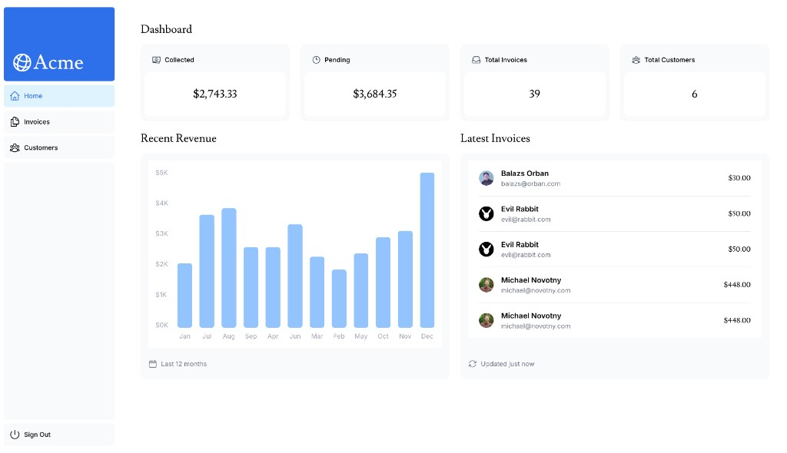

# Next.js App Router — Dashboard

Dashboard app from the [Next.js Learn](https://nextjs.org/learn) App Router course.

## Live demo

**Production (Vercel):** [nextjs-invoice-dashbaord.vercel.app](https://nextjs-invoice-dashbaord.vercel.app/)

## Preview



## E2E tests (Playwright)

See **[`playwright/README.md`](playwright/README.md)** — commands, env, CI, optional MCP, and Test Agents.

```bash
pnpm build && pnpm test:e2e
```

## Learn more

See the [course curriculum](https://nextjs.org/learn) on the Next.js site.
